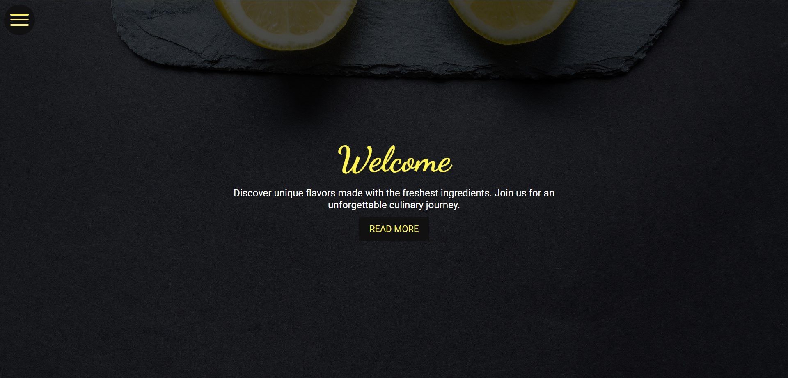
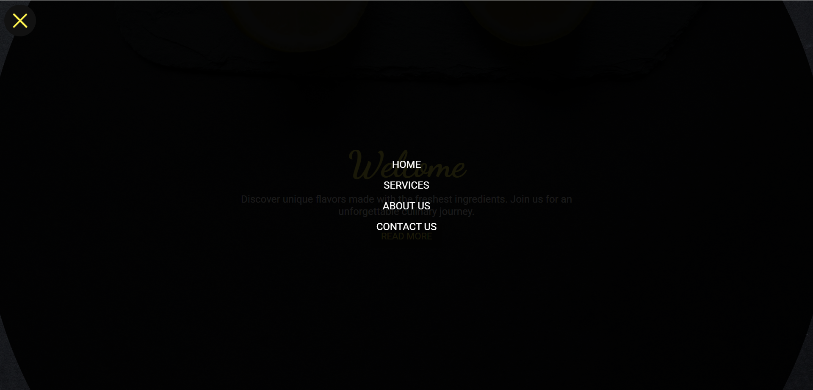

## Ekran Görüntüleri





## Teknolojiler

- HTML5
- CSS3
- Google Fonts
- Responsive Design

## Proje Yapısı

```
├── index.html          # Ana HTML dosyası
├── css/
│   ├── style.css       # Ana stil dosyası
│   └── menu.css        # Menü stilleri
├── img/
│   ├── bg.jpg          # Arkaplan görseli
│   ├── ss.jpg          # Proje ekran görüntüsü
│   └── ss2.png         # Proje ekran görüntüsü
└── README.md           # Bu dosya
```


## Kurulum

1. Projeyi bilgisayarınıza klonlayın:
   ```bash
   git clone https://github.com/username/Restaurant-Menu-With-HTML-CSS.git
   ```

2. Proje dizinine gidin:
   ```bash
   cd Restaurant-Menu-With-HTML-CSS
   ```

3. `index.html` dosyasını web tarayıcınızda açın.

## Kullanım

- Sol üst köşedeki hamburger menü ikonuna tıklayarak navigasyon menüsünü açabilirsiniz
- Menü tamamen responsive olup mobil cihazlarda da mükemmel çalışır
- Modern CSS animasyonları ile kullanıcı deneyimi geliştirilmiştir
